# Maahir

**AI & Systems Engineer** · Building high-throughput reinforcement learning, GPU physics, and computer vision.

[Portfolio](https://maahirrrr.github.io/maahir-co/) · [GitHub](https://github.com/Maahirrrr) · [LinkedIn](https://linkedin.com)

 

 

---

### Selected Work

#### [NVIDIA CUDA Swarm Racing AI](https://github.com/Maahirrrr/NVIDIA-CUDA-Swarm-Racing-AI)
An Isaac-Gym-style GPU racing simulator executing 2,048 autonomous vehicles simultaneously in CUDA VRAM. Delivers 166,000+ physics steps per second on consumer hardware with 29D Frenet waypoint lookaheads, aerodynamic downforce, and vectorized PPO.
> `PyTorch` · `CUDA C++` · `PPO (GAE-λ)` · `Pacejka Tire Dynamics` · `LiDAR Raycasting`

#### [F1 Driver Replay](https://github.com/Maahirrrr/F1-driver-replay)
Interactive Formula 1 telemetry analyzer that reconstructs real driver trajectories, speed deltas, and braking points with real-time ghost comparison.
> `Python` · `FastF1 API` · `Telemetry Kinematics` · `Matplotlib` · `Data Visualization`

#### [Real-Time Object Detection](https://github.com/Maahirrrr/object-detection)
High-throughput spatial computer vision pipeline for real-time bounding box prediction and multi-class tracking.
> `YOLOv8x` · `OpenCV` · `PyTorch` · `Deep Learning`

#### [A* Maze Generator & Pathfinding](https://github.com/Maahirrrr/Maze-Generator---Solver-using-A-)
Procedural maze generation engine and graph pathfinding visualizer using the $A^*$ search heuristic.
> `Python` · `Graph Algorithms` · `Heuristics` · `Pygame`

#### [NyAI Legal Platform](https://github.com/Maahirrrr/nyai.github.io)
Domain-specific Retrieval-Augmented Generation (RAG) assistant for plain-language legal document comprehension.
> `LLMs` · `RAG` · `Vector Embeddings` · `NLP`

---

### Core Stack

* **Machine Learning:** PyTorch, CUDA, PPO, Reinforcement Learning, Diffusion, Transformers, YOLO
* **Mathematics:** Linear Algebra ($SE(3)$, SVD), Multivariable Calculus, Vectorized Kinematics, Lie Algebras
* **Languages & Tools:** Python, C++, Git, Docker, Linux, NumPy, SciPy

---

Engineered with precision.

